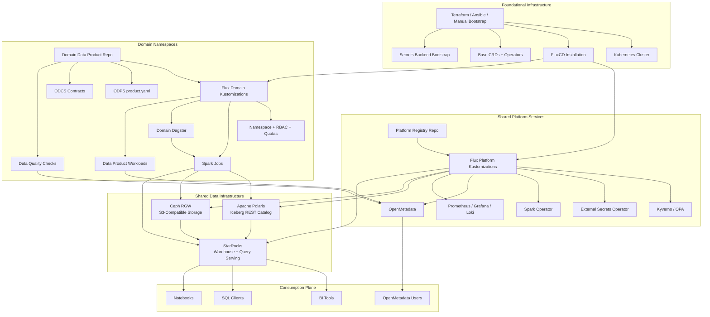
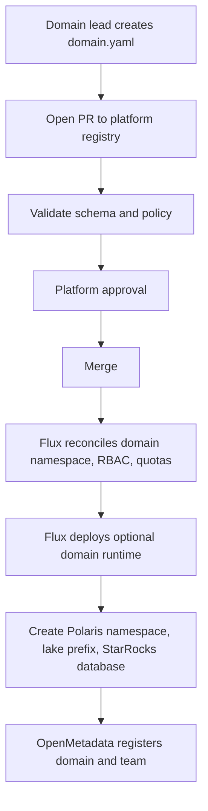
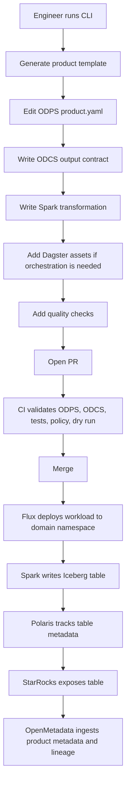
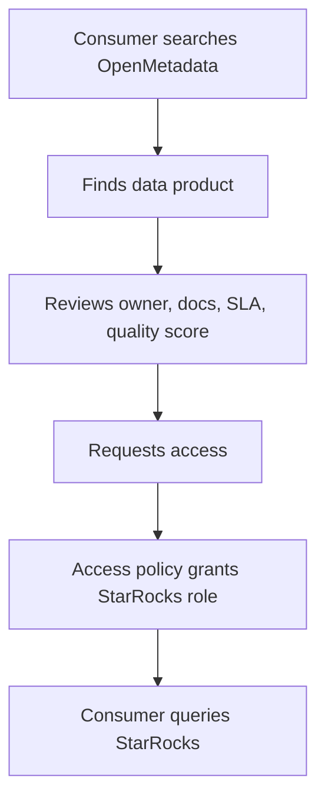
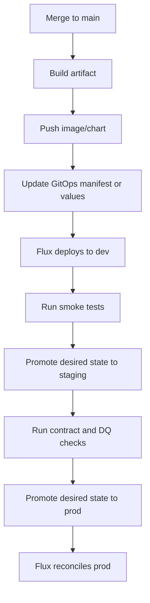

# DataHive Design

## 1. Purpose

Build a self-service DataHive platform that allows domain teams to create, deploy, govern, observe, and serve data products independently.

The MVP should be simple enough to understand and operate:

- one Kubernetes platform cluster
- one FluxCD installation
- shared platform services with domain-level isolation
- domain-owned data product repositories
- Open Data Product Standard validation for data products
- Open Data Contract Standard validation for output-port contracts
- Spark-based transformation on Kubernetes
- Dagster orchestration in domain namespaces
- Apache Iceberg lakehouse storage
- Apache Polaris catalog
- StarRocks serving/query layer
- OpenMetadata catalog and governance
- basic data quality, lineage, and observability

The design should avoid premature physical isolation. Start with shared clusters and logical isolation. Add more clusters or GitOps controllers only when scale, compliance, ownership, or blast-radius requirements make that necessary.

## 2. Core Architecture Decisions

### 2.1 Infrastructure Boundaries

DataHive uses two infrastructure boundaries.

**Foundational infrastructure** bootstraps the platform and should contain only resources that are not safely or naturally deployed by FluxCD watching Helm charts or Kustomize manifests.

Foundational infrastructure includes:

- Kubernetes cluster creation
- node pools and base networking
- storage classes and CSI drivers
- initial secrets backend integration
- FluxCD installation
- Terraform, Ansible, or manual platform bootstrap scripts
- CRDs and operators required before GitOps can reconcile applications
- on-premise primitives that must exist before Kubernetes workloads can run

**Domain infrastructure** is desired state deployed by FluxCD from Git.

Domain infrastructure includes:

- domain namespaces
- quotas and limit ranges
- service accounts and RBAC
- ExternalSecret resources
- per-domain Spark jobs
- per-domain Dagster deployments
- data product workloads
- Helm releases and values
- network policies
- StarRocks databases, roles, and grants
- Polaris namespaces and catalog grants
- object-storage buckets, prefixes, and policies when managed through Kubernetes APIs

Rule of thumb: if the resource can be represented as a Kubernetes custom resource, Helm release, or Kustomize manifest and reconciled by FluxCD, it belongs in domain or shared platform GitOps. If it is needed to make FluxCD or the cluster itself exist, it belongs in foundational infrastructure.

Crossplane is not part of the MVP default stack. A Crossplane composition is a reusable Kubernetes API abstraction that lets users create a higher-level claim, such as `DomainRuntime`, while Crossplane expands it into lower-level managed resources. That is useful when a platform wants Kubernetes-native self-service provisioning across cloud services or many infrastructure providers. For an on-premise MVP where most resources are Kubernetes applications, Helm releases, namespaces, object-storage policies, and database/catalog grants, FluxCD plus small purpose-built automation is simpler.

Add Crossplane later only if DataHive needs a stable self-service control-plane API for infrastructure resources that cannot be cleanly managed with Helm/Kustomize, Terraform modules, or direct platform automation.

### 2.2 GitOps

Use **one FluxCD installation for MVP**.

The single Flux installation reconciles separate platform and domain sources:

- platform shared-services repo or folder
- domain registry repo
- domain data product repos

Isolation should be achieved with Flux Kustomizations, namespaces, service accounts, RBAC, CODEOWNERS, and required PR checks.

Do not introduce a second Flux installation in MVP. A second Flux instance can be added later if there is a concrete need for stronger controller isolation, independent platform/domain ownership, or smaller failure blast radius.

### 2.3 Catalog

Use **OpenMetadata** as the platform metadata catalog.

OpenMetadata is responsible for:

- domain cataloging
- data product cataloging
- ownership metadata
- glossary and tags
- lineage visualization
- quality results
- profiling results
- documentation
- discovery
- governance metadata

OpenMetadata is not the primary SQL query interface.

Use one shared OpenMetadata deployment for MVP. Each domain is represented as an OpenMetadata domain/team with its own ownership, glossary, tags, and documentation boundaries.

### 2.4 Data Product and Contract Standards

Use **Open Data Product Standard**, abbreviated as **ODPS**, for data product metadata.

Each data product must include an ODPS-compatible `product.yaml`. The ODPS file is the product-level description and governance entrypoint.

Use **Open Data Contract Standard**, abbreviated as **ODCS**, for producer-consumer contracts.

Each output port that publishes a dataset must reference an ODCS-compatible contract file. ODCS defines schema, quality expectations, SLA, roles, support information, and server/storage details for the output.

ODPS and ODCS have different jobs:

| Standard | Purpose |
| --- | --- |
| ODPS | Describes the data product, its ports, team, support, lifecycle, and platform metadata |
| ODCS | Describes the contract for a specific data output |

### 2.5 Lakehouse

Use:

- **Apache Iceberg** as the table format
- **Apache Polaris** as the Iceberg REST catalog
- **Ceph RGW / S3-compatible object storage** as the lake storage
- **Spark** as the transformation engine
- **StarRocks** as the warehouse and serving/query engine

Apache Polaris is the fixed catalog choice. No Nessie, Hive Metastore, or Trino should be part of the MVP.

Use one shared Polaris deployment for MVP. Each domain receives a Polaris namespace and catalog grants.

Use one shared Ceph/S3 lake for MVP. Each domain receives isolated buckets or prefixes with explicit access policies.

### 2.6 Transformation and Orchestration

Spark and Dagster are shared platform capabilities but domain-scoped runtimes.

For MVP:

- run one shared Spark Operator in the platform namespace
- run Spark jobs in each domain namespace
- deploy Dagster per domain namespace when the domain needs orchestration
- keep Dagster configuration, secrets, schedules, and run history isolated per domain

Do not create a physical Spark cluster or Dagster control plane per domain unless a domain has a concrete isolation or scale requirement. Kubernetes namespaces, quotas, service accounts, and network policies are the default isolation model.

### 2.7 Query and Serving

Use **StarRocks** as the primary analytical serving layer.

StarRocks is responsible for:

- querying Iceberg tables
- serving BI workloads
- serving SQL workloads
- maintaining materialized views
- accelerating frequently consumed data products

Use one shared StarRocks cluster for MVP. Each domain receives logical isolation through databases, roles, resource groups, quotas, and grants.

Users should query data through:

- StarRocks SQL clients
- BI tools
- notebooks connected to StarRocks
- future platform query portal

Users should discover data through OpenMetadata.

## 3. High-Level Architecture



## 4. Repository Structure

### 4.1 Platform Blueprint Repo

Reusable modules and templates live here.

```text
datahive-blueprints/
  helm-charts/
    domain-runtime/
    data-product/
    dagster-domain/
    spark-application/
  terraform-modules/
    cluster-bootstrap/
    flux-bootstrap/
  scripts/
    bootstrap/
    grants/
  policy-packs/
  repo-templates/
    domain-repo/
    data-product/
  ci-templates/
  schemas/
    domain.schema.json
    odps-extensions.schema.json
```

### 4.2 Platform Registry Repo

Organization desired state lives here. This repo defines domains and shared platform service configuration.

```text
datahive-registry/
  org.yaml

  environments/
    dev.yaml
    staging.yaml
    prod.yaml

  domains/
    finance.yaml
    marketing.yaml

  shared-services/
    openmetadata.yaml
    polaris.yaml
    starrocks.yaml
    ceph-rgw.yaml
    monitoring.yaml
    external-secrets.yaml
    spark-operator.yaml

  flux/
    platform/
    domains/

  access/
    groups.yaml
    policies.yaml
```

### 4.3 Domain Repo

Each domain owns one or more data product repositories.

```text
finance-data-products/
  README.md

  products/
    monthly_revenue/
      product.yaml

      contracts/
        monthly_revenue.odcs.yaml

      pipelines/
        spark/
          monthly_revenue.py
          tests/
            test_monthly_revenue.py

      orchestration/
        dagster/
          assets.py
          definitions.py

      sql/
        starrocks/
          materialized_views.sql
          grants.sql

      quality/
        checks.yaml

      docs/
        overview.md
        runbook.md
        changelog.md

      deploy/
        values-dev.yaml
        values-staging.yaml
        values-prod.yaml
        sparkapplication.yaml
        dagster-values.yaml

  shared/
    libs/
    schemas/

  .github/
    workflows/
      ci.yaml
      release.yaml
```

## 5. Domain Specification

A domain is the ownership boundary for one or more data products. This platform-specific domain file is intentionally small. Product metadata belongs in ODPS files.

```yaml
apiVersion: datahive.platform/v1alpha1
kind: Domain
metadata:
  name: finance
  displayName: Finance
spec:
  owner:
    team: finance-data-engineering
    email: finance-data@example.com
    slack: "#finance-data"

  git:
    provider: gitlab
    group: data-products
    repo: finance-data-products

  runtime:
    namespace: dh-finance
    serviceAccount: finance-runner

  isolation:
    kubernetesNamespace: dh-finance
    polarisNamespace: finance
    starrocksDatabase: finance
    lakePrefix: s3://org-lakehouse/domains/finance/

  quotas:
    cpu: "32"
    memory: "128Gi"

  access:
    adminGroups:
      - finance-data-engineers
    readerGroups:
      - finance-analysts

  capabilities:
    sparkJobs: true
    dagster: true
    starrocksPublishing: true
```

## 6. Data Product Specification

A data product is the deployable unit owned by a domain. DataHive uses ODPS v1.0.0 for the product specification: https://bitol-io.github.io/open-data-product-standard/v1.0.0/

The ODPS file should remain product-focused. DataHive-specific deployment hints should go under `customProperties` so the product remains compatible with ODPS tooling.

```yaml
apiVersion: v1.0.0
kind: DataProduct

id: 9a1ab8f5-9f5f-4f43-9346-0d2b47778b3f
name: Monthly Revenue
version: v1.0.0
status: active
domain: finance
tenant: default

description:
  purpose: Monthly revenue metrics by region and business unit.
  limitations: Excludes unposted transactions.
  usage: Used for finance reporting and executive dashboards.

tags:
  - finance
  - revenue

inputPorts:
  - name: billing_events
    version: v1.0.0
    contractId: billing.billing_events.v1

outputPorts:
  - name: monthly_revenue
    description: Monthly revenue Iceberg table.
    type: tables
    version: v1.0.0
    contractId: finance.monthly_revenue.v1
    authoritativeDefinitions:
      - type: implementation
        url: ./contracts/monthly_revenue.odcs.yaml

managementPorts:
  - name: monthly-revenue-observability
    content: observability
    type: rest
    url: https://grafana.example.com/d/data-products/monthly-revenue
    description: Runtime health and freshness dashboard.

support:
  - channel: finance-data
    url: slack://channel?team=example&id=finance-data
    tool: slack
    scope: interactive
  - channel: finance-data-email
    url: mailto:finance-data@example.com
    tool: email
    scope: issues

team:
  name: finance-analytics
  description: Finance analytics data product team.
  members:
    - username: finance-data-owner
      name: Finance Data Owner
      role: owner
      dateIn: "2026-01-01"
    - username: finance-data-steward
      name: Finance Data Steward
      role: steward
      dateIn: "2026-01-01"

customProperties:
  - property: datahiveProductId
    value: finance.monthly_revenue
    description: Stable DataHive product identifier.
  - property: kubernetesNamespace
    value: dh-finance
    description: Domain namespace where workloads run.
  - property: polarisNamespace
    value: finance
    description: Polaris namespace for Iceberg tables.
  - property: starrocksDatabase
    value: finance
    description: StarRocks database exposed to consumers.
  - property: sparkEntrypoint
    value: pipelines/spark/monthly_revenue.py
    description: Spark application entrypoint.
  - property: dagsterDefinitions
    value: orchestration/dagster/definitions.py
    description: Optional Dagster definitions file.
  - property: qualityChecks
    value: quality/checks.yaml
    description: Data quality definition file.
  - property: deploymentValues
    value: deploy/values-prod.yaml
    description: Helm values used by Flux for production.

authoritativeDefinitions:
  - type: canonicalUrl
    url: https://git.example.com/data-products/finance/monthly_revenue
    description: Canonical source repository for this product.
  - type: transformationImplementation
    url: ./pipelines/spark/monthly_revenue.py
    description: Spark transformation implementation.
```

## 7. ODCS Contract Example

Each data product output port must have an ODCS-compatible contract.

```yaml
apiVersion: v3.0.0
kind: DataContract
id: finance.monthly_revenue.v1
name: Monthly Revenue
version: 1.0.0
status: active
domain: finance
tenant: default

description:
  purpose: Monthly revenue metrics by region and business unit.
  limitations: Excludes unposted transactions.
  usage: Used for finance reporting and executive dashboards.

team:
  - username: finance-data-owner
    role: owner
    dateIn: "2026-01-01"

roles:
  - role: owner
    access: write
    firstLevelApprovers:
      - finance-data-owner
  - role: consumer
    access: read

schema:
  - name: month
    physicalType: date
    logicalType: date
    required: true
    description: Revenue month.
  - name: region
    physicalType: string
    logicalType: text
    required: true
    description: Sales region.
  - name: business_unit
    physicalType: string
    logicalType: text
    required: true
    description: Business unit.
  - name: revenue
    physicalType: decimal
    logicalType: number
    required: true
    description: Revenue amount.
  - name: updated_at
    physicalType: timestamp
    logicalType: timestamp
    required: true
    description: Last update timestamp.

quality:
  - type: library
    specification:
      library: soda
      checks:
        - row_count > 0
        - missing_count(month) = 0
        - missing_count(region) = 0
        - missing_count(revenue) = 0
        - duplicate_count(month, region, business_unit) = 0

support:
  - channel: finance-data
    url: slack://channel?team=example&id=finance-data
    tool: slack
  - channel: finance-data-email
    url: mailto:finance-data@example.com
    tool: email

sla:
  availability: 99.5
  retention: 2555d
  latency: 24h
  frequency: daily

servers:
  - server: polaris
    type: datalake
    environment: prod
    format: iceberg
    catalog: polaris
    location: s3://org-lakehouse/domains/finance/products/monthly_revenue

customProperties:
  - property: outputPort
    value: monthly_revenue
  - property: classification
    value: confidential
  - property: starrocksTable
    value: monthly_revenue
```

## 8. User Flows

### 8.1 Domain Onboarding



### 8.2 Data Product Creation



### 8.3 Consumer Discovery



## 9. CLI Commands

### 9.1 Create Domain

```bash
datahive domain init finance \
  --display-name "Finance" \
  --git-provider gitlab \
  --repo finance-data-products
```

### 9.2 Create Data Product

```bash
datahive product init monthly_revenue \
  --domain finance \
  --template spark-iceberg-starrocks \
  --product-standard odps \
  --contract-standard odcs
```

### 9.3 Validate Product

```bash
datahive product validate products/monthly_revenue
```

### 9.4 Deploy Product

```bash
datahive product deploy products/monthly_revenue --env dev
```

The deploy command should update the GitOps desired state only. FluxCD performs the actual cluster reconciliation.

## 10. CI Requirements

Every data product PR must run:

```text
1. YAML validation
2. ODPS product validation
3. ODCS contract validation
4. Contract compatibility check
5. Spark unit tests
6. Dagster definition validation when Dagster is used
7. SQL linting
8. Data quality definition validation
9. Container build
10. Vulnerability scan
11. Policy-as-code validation
12. Helm/Kustomize dry run
```

## 11. CD Flow



## 12. Governance Rules

Deployments must be rejected when:

- ODPS product file is missing or invalid
- ODCS contract is missing for a published output port
- owner or support channel is missing
- output port is missing
- data classification is missing
- quality checks are missing for a production output
- SLO is missing for a production output
- secrets are committed to Git
- container runs as root
- resource requests exceed domain quota
- product is not registered in the platform registry when registration is required

Governance is enforced through:

| Layer | Enforcement |
| --- | --- |
| Git | PR reviews, CODEOWNERS, required checks |
| CI | ODPS validation, ODCS validation, contract tests |
| FluxCD | desired-state reconciliation and drift correction |
| Kubernetes | namespaces, RBAC, quotas, Kyverno / OPA policies |
| Storage | bucket or prefix policy, IAM, encryption |
| Polaris | namespace access and catalog grants |
| StarRocks | databases, roles, grants, resource groups |
| OpenMetadata | ownership, glossary, classification, documentation |
| Runtime | audit logs, metrics, alerts |

## 13. Observability

Each data product should expose:

- freshness
- row count
- schema drift
- null rate
- duplicate rate
- quality score
- last successful run
- failed run count
- SLA status
- downstream consumers
- owner/team
- cost estimate

Central dashboards should include:

- domain health
- product health
- Spark job health
- Dagster run health
- StarRocks health
- Polaris health
- object storage health
- OpenMetadata ingestion health
- Flux sync status

## 14. MVP Scope

Implement first:

1. Foundational cluster and Flux bootstrap
2. Platform registry repo
3. Domain repo template
4. Domain YAML schema
5. ODPS product validation
6. ODCS contract validation
7. GitHub/GitLab repo factory module
8. Shared Spark Operator
9. Domain-scoped SparkApplication deployment
10. Optional domain-scoped Dagster deployment
11. Iceberg writes to S3/Ceph
12. Polaris namespace integration
13. StarRocks external catalog integration
14. OpenMetadata ingestion
15. Basic CI checks
16. Basic FluxCD deployment
17. Prometheus/Grafana dashboards

## 15. Non-Goals for MVP

Do not implement in MVP:

- multiple FluxCD instances
- per-domain physical Kubernetes clusters
- per-domain physical Polaris clusters
- per-domain physical StarRocks clusters
- per-domain physical OpenMetadata deployments
- Trino
- Nessie
- Hive Metastore
- custom SQL UI inside OpenMetadata
- full SaaS billing
- multi-cloud marketplace
- automatic data access approval workflow
- advanced cost optimization
- real-time streaming
- ML feature store
- semantic layer

## 16. Implementation Milestones

### Milestone 1: Reference Stack

- Kubernetes cluster
- FluxCD bootstrap
- Spark Operator
- Ceph/S3-compatible object storage
- Apache Polaris
- StarRocks
- OpenMetadata
- Prometheus/Grafana

### Milestone 2: Platform Registry

- domain schema
- ODPS validation hook
- ODCS validation hook
- validation CLI
- repo templates
- Git provider abstraction

### Milestone 3: Domain Golden Path

- generate domain repo
- create domain namespace, RBAC, quotas
- create Polaris namespace
- create lake prefix or bucket policy
- create StarRocks database and roles
- generate ODPS data product skeleton
- validate ODCS contract
- deploy Spark job through FluxCD
- write Iceberg table
- expose through StarRocks
- ingest into OpenMetadata

### Milestone 4: Orchestration and Governance

- optional domain Dagster deployment
- required CI checks
- contract compatibility validation
- data quality checks
- Kyverno / OPA policies
- StarRocks RBAC templates
- OpenMetadata domain and product registration

### Milestone 5: Production Readiness

- environment promotion
- alerts
- dashboards
- audit logs
- backup and restore
- upgrade playbooks
- disaster recovery checks

## 17. Default Stack

| Layer | Default |
| --- | --- |
| Catalog UI | OpenMetadata |
| Data product standard | Open Data Product Standard |
| Contract standard | Open Data Contract Standard |
| Transformation | Spark Operator with domain-scoped Spark jobs |
| Orchestration | Domain-scoped Dagster |
| Table format | Apache Iceberg |
| Iceberg catalog | Apache Polaris |
| Lake storage | Ceph RGW / S3 |
| Warehouse / serving | StarRocks |
| GitOps | FluxCD |
| Foundational IaC | Terraform, Ansible, or manual bootstrap scripts |
| Policy | Kyverno or OPA |
| Secrets | External Secrets Operator |
| Observability | Prometheus, Grafana, Loki, OpenTelemetry |
