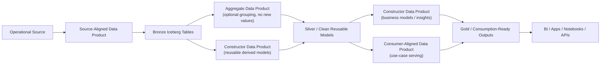

# DataHive Architecture

## 1. Purpose

DataHive is a self-service data product platform for domain teams. It should help teams create, deploy, govern, observe, and consume data products without making the platform team own every pipeline.

The platform should start with a production-like baseline that stays operationally simple:

- one Kubernetes platform cluster
- one ArgoCD installation
- shared substrate services and shared runtime infrastructure where sharing is clearly useful
- ODPS for data product metadata
- ODCS for output-port data contracts
- Iceberg tables on S3-compatible object storage
- Polaris as the Iceberg REST catalog
- StarRocks as the warehouse, SQL transformation, and serving layer
- OpenMetadata as the discovery and governance catalog
- substrate-managed Kafka brokers and Kafka Connect worker pools
- shared Dagster, Ray, and dbt execution environments with logical isolation

## 2. Design Principles

1. **Product ownership first**
   Data products own their data, ingestion intent, workload definitions, contracts, quality checks, documentation, and lifecycle. The shared platform provides substrate and runtime infrastructure, not product-specific pipeline ownership.

2. **Share substrate, not product logic**
   It is reasonable to share Kubernetes, ArgoCD, object storage, Polaris, StarRocks, OpenMetadata, Kafka, Kafka Connect, Dagster, Ray, dbt execution environments, secrets integration, policy, and observability. It is not reasonable for the shared platform to own source semantics, data contracts, dbt models, Dagster graphs, or product-specific Ray jobs.

3. **Start with logical isolation**
   Use Kubernetes namespaces, service accounts, RBAC, quotas, network policies, workload queues and concurrency limits, StarRocks databases/roles, Polaris namespaces, storage prefixes/buckets, and Kafka ACLs with topic naming conventions. Add separate physical clusters only when scale, compliance, cost, or blast-radius requirements justify them.

4. **Warehouse-native ETL by default**
   Operational sources land into bronze through source-aligned ingestion products. Silver models are cleaned, standardized, and reusable. Gold models are consumption-ready. Aggregate products publish silver outputs. Constructor products may publish silver or gold outputs depending on whether their outputs are reusable intermediate models or consumption-ready business models. Consumer-aligned products serve specific consuming applications or workflows through gold outputs. Transformations are SQL-first through StarRocks and dbt or equivalent tooling.

5. **No premature control plane**
   Multiple Kubernetes clusters, multiple ArgoCD instances, and Crossplane are not defaults. Add them only when there is a concrete operational need.

## 3. Data Product Types

DataHive uses explicit data product types. These types describe ownership and intent; they should be expressed in ODPS metadata, not hardcoded as a separate platform-specific product schema.

| Type | Purpose | Owns | Does not own |
| --- | --- | --- | --- |
| Source-aligned data product | Publishes data from an operational source into the lake. | Ingestion intent, source contracts, connector declarations, bronze tables, source quality checks, SLOs, runbooks, and lifecycle. | Shared Kafka or Kafka Connect infrastructure, cross-source business logic, or consumer-specific shaping. |
| Aggregate data product | Groups multiple existing streams/tables and exposes them together without changing business meaning or constructing new values. | Silver grouped outputs, combined access surface, contracts, documentation, lifecycle. | Business transformations, new metrics, or gold consumer outputs. |
| Constructor data product | Constructs new data values, derived entities, metrics, or business insights. | Transformation logic, dbt models, silver or gold outputs, quality rules, contracts. | Raw source capture unless it is also explicitly source-aligned, or consumer-specific shaping unless explicitly delegated. |
| Consumer-aligned data product | Shapes and serves data for a specific end use, application, team, dashboard, feature, or workflow. | Consumer-facing gold outputs, usability guarantees, access policy, SLOs. | Upstream source, reusable silver construction, or enterprise-wide canonical definitions unless explicitly delegated. |

Important distinction:

- If a product only bundles or co-publishes multiple upstream datasets, it is an **aggregate data product**.
- If a product changes meaning, computes new values, derives metrics, deduplicates into a new entity, or creates business insight, it is a **constructor data product**.
- If a product is optimized for a particular end user or consumption workflow, it is a **consumer-aligned data product**.

## 4. Standards

DataHive conforms to existing open standards instead of inventing detailed custom product schemas in this document.

| Concern | Standard |
| --- | --- |
| Data product metadata | Open Data Product Standard, ODPS v1.0.0 |
| Output-port contracts | Open Data Contract Standard, ODCS |
| Table format | Apache Iceberg |
| Iceberg catalog protocol | Apache Polaris / Iceberg REST catalog |
| SQL transformation project structure | dbt conventions or equivalent SQL model tooling |
| Metadata discovery and governance | OpenMetadata entities, domains, ownership, lineage, and glossary |

Detailed ODPS extensions, validation schemas, and examples live in a separate specification document.

## 5. Component Ownership

### 5.1 Shared Substrate

The platform team should operate the minimum shared substrate:

- Kubernetes cluster
- ArgoCD
- Hashicorp Vault
- Kyverno or OPA policy
- Ceph RGW or another S3-compatible object store
- Apache Polaris
- StarRocks
- OpenMetadata
- Kafka and Kafka Connect
- Dagster
- Ray
- dbt execution environments
- Prometheus, Grafana, Loki, and OpenTelemetry
- reusable Helm charts, templates, and CI checks

These components are shared because they are expensive or confusing to duplicate per product and can be isolated logically.

### 5.2 Domain/Product-Owned Logic

The following should be owned by the data product that needs them:

- connector declarations for source-aligned ingestion
- source credentials binding
- source contracts
- output contracts and event semantics
- product SLOs, quality checks, runbooks, dashboards, and alerts
- dbt project and transformation models
- Dagster jobs, schedules, and orchestration graphs, when orchestration is needed
- Ray jobs and ML workloads, when AI/ML workloads are needed
- Kafka topics and schemas
- deployment lifecycle for their workloads

The platform may provide templates, operators, and admission checks, but source-specific meaning stays with the data product or domain.

## 6. Data Flow

The default data flow is:

Notes:

- Medallion layers describe data model maturity. Data product types describe ownership and intent, so they do not map one-to-one to layers.
- Aggregate products do not create new business values. If they do, they become constructor products.
- Aggregate products publish reusable silver outputs by default.
- Constructor products should use StarRocks SQL and dbt or equivalent tooling by default. They may publish reusable silver outputs for other data products, or consumption-ready gold outputs when they create business models, metrics, or insights that can be served directly.
- Consumer-aligned products optimize and serve data for a specific use case. They depend on cleaned silver models, including reusable constructor outputs, and publish consumer-facing gold outputs.
- Bronze-to-gold transformation should be treated as an anti-pattern by default. Gold outputs should be built from cleaned, validated silver models unless a documented exception is accepted.

## 7. Platform Architecture

```mermaid
flowchart TB
    subgraph Foundation["Foundational Infrastructure"]
        Cluster["Kubernetes"]
        ArgoCD["ArgoCD"]
        Vault["Hashicorp Vault"]
    end

    subgraph Shared["Shared Substrate"]
        ObjectStore["S3-Compatible Object Storage"]
        Polaris["Apache Polaris"]
        StarRocks["StarRocks"]
        OpenMetadata["OpenMetadata"]
        Kafka["Kafka"]
        KafkaConnect["Kafka Connect"]
        DagsterRuntime["Dagster"]
        RayRuntime["Ray"]
        DbtRuntime["dbt Execution"]
        Policy["Kyverno / OPA"]
        Observability["Observability Stack"]
        Templates["Runtime Templates"]
    end

    subgraph Domains["Domain/Product-Owned Responsibility"]
        ConnectorSpecs["Connector Specs"]
        TopicContracts["Source + Output-Topic Contracts"]
        SQLModels["dbt / SQL Models"]
        DagsterJobs["Dagster Jobs / Graphs"]
        RayJobs["Ray Jobs / ML Workloads"]
        Contracts["ODPS + ODCS"]
        Quality["Quality Checks"]
    end

    ArgoCD --> Shared
    ArgoCD --> Domains
    Templates --> Domains
    ConnectorSpecs --> KafkaConnect
    KafkaConnect --> Kafka
    Kafka --> Domains
    SQLModels --> DbtRuntime
    DagsterJobs --> DagsterRuntime
    RayJobs --> RayRuntime
    Domains --> ObjectStore
    Domains --> Polaris
    Domains --> StarRocks
    Domains --> OpenMetadata
    Policy --> Domains
    Observability --> Shared
    Observability --> Domains
```

## 8. Repository Boundaries

| Repository | Purpose |
| --- | --- |
| datahive-blueprints | Reusable Helm charts, templates, CI templates, policies, and bootstrap scripts. |
| datahive-registry | Organization, environments, domains, shared substrate configuration, and access policy. |
| Domain/product repos | ODPS product metadata, ODCS contracts, connector declarations, dbt models, Dagster job definitions, Ray workload configs, quality checks, docs, and deployment values. |

## 9. Initial Platform Scope

Implement first:

1. Kubernetes and ArgoCD bootstrap
2. Platform registry and domain onboarding
3. Domain namespace, RBAC, quotas, and secrets integration
4. Shared object storage, Polaris, StarRocks, OpenMetadata, Kafka/Kafka Connect, policy, and observability
5. ODPS product validation
6. ODCS contract validation
7. Source-aligned product template
8. Constructor product template using StarRocks SQL and dbt
9. Consumer-aligned product template
10. Source-aligned connector declaration template for substrate-managed Kafka/Kafka Connect
11. Shared Dagster runtime with product/domain-owned job templates
12. Shared Ray runtime with product/domain-owned workload templates
13. Basic lineage, quality, and freshness reporting into OpenMetadata

Aggregate products can be supported by the same product template once product type metadata and ownership rules are clear.

## 10. Default Stack

| Layer | Default |
| --- | --- |
| Data product metadata | ODPS v1.0.0 |
| Data contracts | ODCS |
| Ingestion ownership | Source-aligned data products |
| Streaming/CDC runtime | Substrate-managed Kafka/Kafka Connect |
| Transformation | StarRocks SQL with dbt or equivalent on shared execution environments |
| AI/ML runtime | Shared Ray runtime with product/domain-owned workloads when needed |
| Orchestration | Shared Dagster runtime with product/domain-owned jobs when needed |
| Table format | Apache Iceberg |
| Lake storage | Ceph RGW / S3-compatible storage |
| Iceberg catalog | Apache Polaris |
| Warehouse / serving | StarRocks |
| Metadata catalog | OpenMetadata |
| GitOps | ArgoCD |
| Policy | Kyverno or OPA |
| Observability | Prometheus, Grafana, Loki, OpenTelemetry |
