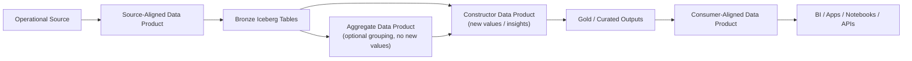
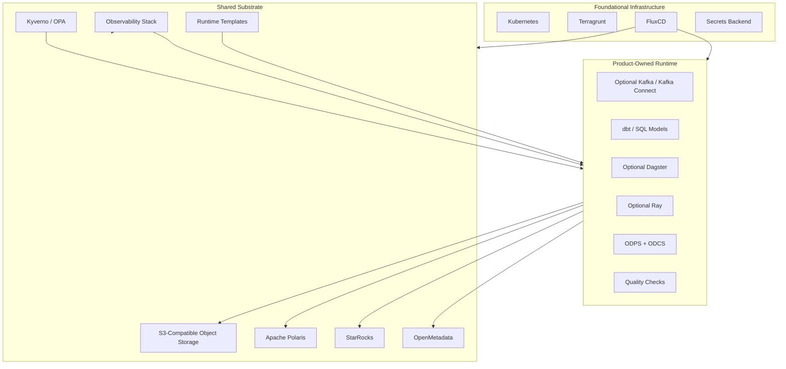

# DataHive Architecture

## 1. Purpose

DataHive is a self-service data product platform for domain teams. It should help teams create, deploy, govern, observe, and consume data products without making the platform team own every pipeline.

The MVP should stay simple:

- one Kubernetes platform cluster
- one FluxCD installation
- shared substrate services where sharing is clearly useful
- data-product-owned runtime components where ownership matters
- ODPS for data product metadata
- ODCS for output-port data contracts
- Iceberg tables on S3-compatible object storage
- Polaris as the Iceberg REST catalog
- StarRocks as the warehouse, SQL transformation, and serving layer
- OpenMetadata as the discovery and governance catalog
- Kafka/Kafka Connect only inside products that need streaming or CDC
- Dagster and Ray only inside products or domains that need them

Spark is not part of the default ETL path. Prefer source-aligned ingestion products, warehouse-native SQL transformations, and optional Ray for AI/ML workloads.

## 2. Design Principles

1. **Product ownership first**
   Data products own their data, runtime choices, contracts, quality checks, documentation, and lifecycle. The shared platform provides substrate and templates, not product-specific pipeline ownership.

2. **Share substrate, not product logic**
   It is reasonable to share Kubernetes, FluxCD, object storage, Polaris, StarRocks, OpenMetadata, secrets integration, policy, and observability. It is not reasonable for the shared platform to own source ingestion logic, Kafka topics, connector configs, dbt models, Dagster graphs, or product-specific Ray jobs.

3. **Start with logical isolation**
   Use Kubernetes namespaces, service accounts, RBAC, quotas, network policies, StarRocks databases/roles, Polaris namespaces, and storage prefixes/buckets. Add separate physical clusters only when scale, compliance, cost, or blast-radius requirements justify them.

4. **Warehouse-native ETL by default**
   Operational sources land into bronze through source-aligned ingestion products. Silver and gold transformations are SQL-first through StarRocks and dbt or equivalent tooling.

5. **No premature control plane**
   Crossplane and multiple FluxCD instances are not MVP defaults. Add them only when there is a concrete operational need.

## 3. Data Product Types

DataHive uses explicit data product types. These types describe ownership and intent; they should be expressed in ODPS metadata, not hardcoded as a separate platform-specific product schema.

| Type | Purpose | Owns | Does not own |
| --- | --- | --- | --- |
| Source-aligned data product | Publishes data from an operational source into the lake. | Source contract, ingestion runtime, bronze tables, source quality checks. | Cross-source business logic or consumer-specific shaping. |
| Aggregate data product | Groups multiple existing streams/tables and exposes them together without changing business meaning or constructing new values. | Combined access surface, contracts, documentation, lifecycle. | Business transformations or new metrics. |
| Constructor data product | Constructs new data values, derived entities, metrics, or business insights. | Transformation logic, dbt models, silver/gold outputs, quality rules, contracts. | Raw source capture unless it is also explicitly source-aligned. |
| Consumer-aligned data product | Shapes data for a specific end use, application, team, dashboard, feature, or workflow. | Consumer-facing outputs, usability guarantees, access policy, SLOs. | Upstream source or enterprise-wide canonical definitions unless explicitly delegated. |

Important distinction:

- If a product only bundles or co-publishes multiple upstream datasets, it is an **aggregate data product**.
- If a product changes meaning, computes new values, derives metrics, deduplicates into a new entity, or creates business insight, it is a **constructor data product**.
- If a product is optimized for a particular end user or consumption workflow, it is a **consumer-aligned data product**.

## 4. Standards

DataHive should conform to existing open standards instead of inventing detailed custom product schemas in this document.

| Concern | Standard |
| --- | --- |
| Data product metadata | Open Data Product Standard, ODPS v1.0.0 |
| Output-port contracts | Open Data Contract Standard, ODCS |
| Table format | Apache Iceberg |
| Iceberg catalog protocol | Apache Polaris / Iceberg REST catalog |
| SQL transformation project structure | dbt conventions or equivalent SQL model tooling |
| Metadata discovery and governance | OpenMetadata entities, domains, ownership, lineage, and glossary |

Detailed ODPS extensions, validation schemas, and examples should live in a separate specification document.

## 5. Component Ownership

### 5.1 Shared Substrate

The platform team should operate the minimum shared substrate:

- Kubernetes cluster
- FluxCD
- External Secrets Operator or equivalent secrets integration
- Kyverno or OPA policy
- Ceph RGW or another S3-compatible object store
- Apache Polaris
- StarRocks
- OpenMetadata
- Prometheus, Grafana, Loki, and OpenTelemetry
- reusable Helm charts, templates, and CI checks

These components are shared because they are expensive or confusing to duplicate per product and can be isolated logically.

### 5.2 Product-Owned Runtime

The following should be owned by the data product that needs them:

- Kafka brokers or Kafka-compatible runtime, when streaming is needed
- Kafka Connect workers and connector configs, when CDC or streaming ingestion is needed
- dbt project and transformation models
- Dagster deployment or definitions, when orchestration is needed
- Ray jobs or Ray cluster, when AI/ML workloads are needed
- product-specific quality checks, runbooks, dashboards, and alerts

The platform may provide templates and operators for these runtimes, but ownership stays with the data product or domain.

### 5.3 When Sharing Product Runtimes Is Acceptable

Kafka, Kafka Connect, Dagster, or Ray may be shared at domain level only when the domain explicitly owns the coupling and operational risk. A global shared Kafka ingestion platform or global Dagster instance should not be part of the MVP because it blurs ownership and creates coordination problems between products.

## 6. Data Flow

The default data flow is:

Notes:

- Kafka/Kafka Connect is an implementation choice inside a source-aligned data product, not a shared platform ingestion layer.
- Aggregate products do not create new business values. If they do, they become constructor products.
- Constructor products should use StarRocks SQL and dbt or equivalent tooling by default.
- Consumer-aligned products optimize data for a specific use case and can depend on source-aligned, aggregate, or constructor products.

## 7. Platform Architecture

## 8. Repository Boundaries

Keep repository structure simple for MVP.

| Repository | Purpose |
| --- | --- |
| Platform blueprints | Reusable Helm charts, templates, CI templates, policies, and bootstrap scripts. |
| Platform registry | Organization, environments, domains, shared substrate configuration, and access policy. |
| Domain/product repos | ODPS product metadata, ODCS contracts, dbt models, optional runtime configs, quality checks, docs, and deployment values. |

Avoid putting detailed product schemas or long YAML examples in this architecture document. Product schema details belong in a dedicated ODPS/ODCS profile document.

## 9. MVP Scope

Implement first:

1. Kubernetes and FluxCD bootstrap
2. Platform registry and domain onboarding
3. Domain namespace, RBAC, quotas, and secrets integration
4. Shared object storage, Polaris, StarRocks, OpenMetadata, policy, and observability
5. ODPS product validation
6. ODCS contract validation
7. Source-aligned product template
8. Constructor product template using StarRocks SQL and dbt
9. Consumer-aligned product template
10. Optional product-owned Kafka/Kafka Connect template
11. Optional product-owned Dagster template
12. Optional product-owned Ray template
13. Basic lineage, quality, and freshness reporting into OpenMetadata

Aggregate products can be supported by the same product template once product type metadata and ownership rules are clear.

## 10. Non-Goals for MVP

Do not implement in MVP:

- Spark as a default ETL runtime
- global shared Kafka ingestion platform
- global shared Kafka Connect worker pool
- global shared Dagster orchestration plane
- mandatory Ray runtime
- multiple FluxCD instances
- Crossplane control-plane abstractions
- per-product physical Polaris, StarRocks, OpenMetadata, or object-storage clusters
- Trino
- Nessie
- Hive Metastore
- custom SQL UI inside OpenMetadata
- semantic layer
- ML feature store
- automatic data access approval workflow
- advanced cost optimization

## 11. Default Stack

| Layer | Default |
| --- | --- |
| Data product metadata | ODPS v1.0.0 |
| Data contracts | ODCS |
| Ingestion ownership | Source-aligned data products |
| Streaming/CDC runtime | Product-owned Kafka/Kafka Connect when needed |
| Transformation | StarRocks SQL with dbt or equivalent |
| AI/ML runtime | Product-owned Ray when needed |
| Orchestration | Product-owned or domain-owned Dagster when needed |
| Table format | Apache Iceberg |
| Lake storage | Ceph RGW / S3-compatible storage |
| Iceberg catalog | Apache Polaris |
| Warehouse / serving | StarRocks |
| Metadata catalog | OpenMetadata |
| GitOps | FluxCD |
| Policy | Kyverno or OPA |
| Observability | Prometheus, Grafana, Loki, OpenTelemetry |

## 12. References

- ODPS v1.0.0: https://bitol-io.github.io/open-data-product-standard/v1.0.0/
- Apache Kafka Connect: https://kafka.apache.org/42/kafka-connect/
- Apache Iceberg Kafka Connect sink: https://iceberg.apache.org/docs/1.10.0/kafka-connect/
- StarRocks Iceberg catalog: https://docs.starrocks.io/docs/data_source/catalog/iceberg/iceberg_catalog/
- StarRocks dbt integration: https://docs.starrocks.io/docs/integrations/dbt/
- Ray Data: https://docs.ray.io/en/latest/data/data.html

